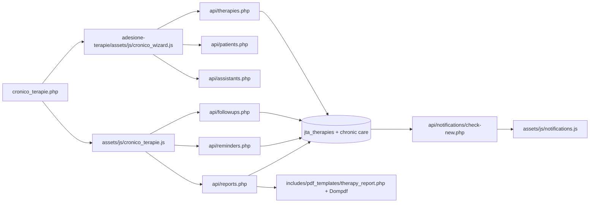

 Analisi tecnica modulo “Adesione Terapie” (Assistente Farmacia)

## Indice
1. [Mappa file (discovery)](#mappa-file-discovery)
2. [File-by-file (schede dettagliate)](#file-by-file-schede-dettagliate)
3. [Architettura del modulo (sintesi)](#architettura-del-modulo-sintesi)
4. [Query critiche](#query-critiche)
5. [Chronic care JSON: punti di lettura/scrittura](#chronic-care-json-punti-di-lettura-scrittura)
6. [Promemoria e notifiche](#promemoria-e-notifiche)
7. [Gap & miglioramenti](#gap--miglioramenti)

---

## Mappa file (discovery)
| File | Descrizione breve |
| --- | --- |
| `cronico_terapie.php` | Pagina pannello per gestione terapie croniche e modali wizard/reminder/report/check. |
| `assets/js/cronico_terapie.js` | Logica front-end: listing, filtri, reminder, follow-up, report preview/PDF. |
| `adesione-terapie/assets/js/cronico_wizard.js` | Wizard creazione/modifica terapia + paziente + survey + consenso. |
| `adesione-terapie/assets/js/signature_pad.js` | Utility firma (consenso) usata dal wizard. |
| `api/therapies.php` | API CRUD terapie + salvataggio dati chronic care/consensi. |
| `api/patients.php` | API ricerca/creazione/aggiornamento pazienti per wizard. |
| `api/assistants.php` | API caregiver/assistenti collegati a terapia. |
| `api/followups.php` | API check periodici e follow-up manuali (snapshot domande/risposte). |
| `api/reminders.php` | API gestione promemoria per terapia. |
| `api/reports.php` | API preview e generazione PDF report terapia. |
| `includes/pdf_templates/therapy_report.php` | Template HTML per report PDF. |
| `api/notifications/check-new.php` | API polling: promemoria in scadenza (e richieste). |
| `assets/js/notifications.js` | Sistema notifiche browser + toast in-app (include promemoria). |
| `assets/css/notifications.css` | Stili toast/notification UI. |
| `assets/css/main.css` | Stili preview report (`.report-preview`). |
| `includes/header.php` | Include CSS (notifiche, main) e bootstrap per le pagine del pannello. |
| `includes/footer.php` | Include JS notifiche e carica script aggiuntivi della pagina (wizard/cronico). |
| `includes/sidebar.php` | Voce menu “Adesione Terapie” -> `cronico_terapie.php`. |
| `QUERY.sql` | DDL tabelle therapy/patients/followups/reminders/reports/chronic care. |
| `migrations/2026-01-09_therapy_reminders_followups.sql` | Migrazione per reminder status/entry_type followup. |

---

## File-by-file (schede dettagliate)

### `cronico_terapie.php`
- **Ruolo:** Pagina UI entrypoint per il modulo (pannello farmacista).
- **Responsabilità principali:**
  - Imposta pagina “Gestione Terapie Paziente Cronico”.
  - Carica JS: `assets/js/cronico_terapie.js` e wizard (`adesione-terapie/assets/js/cronico_wizard.js`).
  - Espone modali vuote per wizard, promemoria, report e check periodici.
- **Input / Output:**
  - Input: sessione utente autenticata (middleware).
  - Output: HTML pagina, container per modali.
- **Dipendenze:**
  - `includes/header.php`, `includes/sidebar.php`, `includes/footer.php`.
  - JS aggiuntivi `assets/js/cronico_terapie.js`, `adesione-terapie/assets/js/cronico_wizard.js`, `adesione-terapie/assets/js/signature_pad.js`.
- **Note importanti:**
  - Accesso limitato a `pharmacist`/`admin` (via `requirePharmacistOrAdmin()`).
- **Punti “rischio regressione”:**
  - Rimozione dei placeholder modali rompe il rendering dinamico in `cronico_terapie.js`.

### `assets/js/cronico_terapie.js`
- **Ruolo:** Controller front-end della pagina “Adesione Terapie”.
- **Responsabilità principali:**
  - Caricamento elenco terapie con filtri/paginazione.
  - Apertura modali per wizard, promemoria, report e check periodici.
  - CRUD promemoria via `api/reminders.php`.
  - Gestione report: preview HTML (`buildReportPreviewHtml`) e PDF (`api/reports.php?action=generate`).
  - Gestione check periodici/follow-up (inizializzazione, aggiunta domande, salvataggio risposte) via `api/followups.php`.
- **Input / Output:**
  - Input: form modali (reminder, report, followup), selezioni terapia, filtri.
  - Output: DOM aggiornato (liste, modali, preview report, toast).
- **Dipendenze:**
  - API: `api/therapies.php`, `api/reminders.php`, `api/reports.php`, `api/followups.php`.
  - Template questionari in `window.SURVEY_TEMPLATES`.
  - CSS `.report-preview` in `assets/css/main.css`.
- **Note importanti:**
  - Sanitizzazione output lato client via `sanitizeHtml()`.
  - Usa `entry_type` e `snapshot` per distinguere check periodici vs follow-up manuali.
- **Punti “rischio regressione”:**
  - Cambiamenti in payload API (campi o nomi) rompono rendering/submit.
  - Alterazione di `buildReportPreviewHtml` impatta preview e PDF (coerenza UX).

### `adesione-terapie/assets/js/cronico_wizard.js`
- **Ruolo:** Wizard di creazione/modifica terapia + paziente + survey + consenso.
- **Responsabilità principali:**
  - Gestione stato wizard (`therapyWizardState`) e step.
  - Caricamento terapia per edit (`api/therapies.php?id=...`).
  - Ricerca pazienti (`api/patients.php`) e assistenti/caregiver (`api/assistants.php`).
  - Raccolta anamnesi, intake, aderenza, survey condizione.
  - Raccolta firma consenso (integrazione signature pad).
  - Submit creazione/modifica terapia (`api/therapies.php` POST/PUT).
- **Input / Output:**
  - Input: form wizard multi-step, firma su canvas.
  - Output: payload JSON completo terapia/paziente/consenso.
- **Dipendenze:**
  - API: `api/therapies.php`, `api/patients.php`, `api/assistants.php`.
  - Signature utilities: `adesione-terapie/assets/js/signature_pad.js`.
- **Note importanti:**
  - Gestisce campi `doctor_info` e `biometric_info` nello state e payload.
  - Imposta `consent.scopes` (care_followup, contact_for_reminders, anonymous_stats).
- **Punti “rischio regressione”:**
  - Modifica struttura `therapyWizardState` senza allineare l’API.
  - Cambiamenti DOM ID/class del wizard rompono il binding JS.

### `adesione-terapie/assets/js/signature_pad.js`
- **Ruolo:** Utility firma per consenso nel wizard.
- **Responsabilità principali:**
  - Inizializza canvas e pulizia firma.
  - Esporta data URL della firma per invio al backend.
- **Input / Output:**
  - Input: interazioni utente sul canvas.
  - Output: data URL immagine firma.
- **Dipendenze:**
  - Utilizzato da `cronico_wizard.js`.
- **Note importanti:**
  - Legato agli ID canvas/clear button del wizard.
- **Punti “rischio regressione”:**
  - Cambiando ID DOM canvas/pulsante si rompe acquisizione firma.

### `api/therapies.php`
- **Ruolo:** API core terapie (list/get, create, update, delete/suspend).
- **Responsabilità principali:**
  - GET list/record con join su pazienti e chronic care.
  - POST crea terapia + chronic care + assistenti + survey + consensi.
  - PUT aggiorna terapia + chronic care + assistenti + survey + consensi.
  - POST action delete, DELETE sospensione (status = suspended).
- **Input / Output:**
  - Input JSON: paziente, terapia, chronic care, survey, consensi.
  - Output JSON: `success`, `data`, `error`.
- **Dipendenze:**
  - Tabelle: `jta_therapies`, `jta_patients`, `jta_pharma_patient`, `jta_therapy_chronic_care`, `jta_therapy_assistant`, `jta_therapy_condition_surveys`, `jta_therapy_consents`.
  - Funzioni: `sanitize`, `get_panel_pharma_id`, `requireApiAuth`.
- **Note importanti:**
  - Decodifica JSON per `general_anamnesis`, `detailed_intake`, `adherence_base`, `flags`, `consent`.
  - In GET include `doctor_info`, `biometric_info`, `care_context` (decode JSON) ma non li salva su POST/PUT.
- **Punti “rischio regressione”:**
  - Cambi campi JSON senza migrazione/compatibilità in wizard.
  - Mancato scoping `pharmacy_id` rompe multi-tenant.

### `api/patients.php`
- **Ruolo:** API pazienti (ricerca/creazione/aggiornamento) per wizard.
- **Responsabilità principali:**
  - GET ricerca pazienti per query.
  - POST crea paziente e associazione in `jta_pharma_patient`.
  - PUT aggiorna dati paziente.
- **Input / Output:**
  - Input JSON (POST/PUT) con dati paziente.
  - Output JSON con `patient_id` o lista `items`.
- **Dipendenze:**
  - Tabelle: `jta_patients`, `jta_pharma_patient`.
- **Note importanti:**
  - Scoping farmacia via `pharmacy_id`.
- **Punti “rischio regressione”:**
  - Cambi in struttura paziente si riflettono nel wizard.

### `api/assistants.php`
- **Ruolo:** API assistenti/caregiver collegabili alla terapia.
- **Responsabilità principali:**
  - GET elenco assistenti farmacia.
  - POST crea assistente.
  - PUT aggiorna assistente.
- **Input / Output:**
  - Input JSON con dati assistente.
  - Output JSON con `assistant_id` o lista `items`.
- **Dipendenze:**
  - Tabella `jta_assistants`.
- **Note importanti:**
  - Filtra per `pharma_id` (farmacia).
- **Punti “rischio regressione”:**
  - Rimozione campo in assistenti rompe mapping in wizard.

### `api/followups.php`
- **Ruolo:** API check periodici e follow-up manuali.
- **Responsabilità principali:**
  - GET lista followup per terapia, filtro `entry_type`.
  - POST `action=init`: crea check periodico con snapshot domande base.
  - POST `action=add-question` / `remove-question`: gestione domande custom.
  - POST `action=answer`: salva risposte su snapshot JSON.
  - POST senza action: salva follow-up manuale (risk_score + note).
  - POST `action=cancel`: marca snapshot come cancellato.
- **Input / Output:**
  - Input JSON con `therapy_id`, `answers`, `risk_score`, `follow_up_date`.
  - Output JSON con `followup`, `snapshot` o `items`.
- **Dipendenze:**
  - Tabelle: `jta_therapy_followups`, `jta_therapies`, `jta_therapy_chronic_care`, `jta_therapy_condition_surveys`.
- **Note importanti:**
  - Usa `snapshot` JSON per domande base + custom; entry_type `check`/`followup`.
  - Status calcolato via `snapshot.canceled`.
- **Punti “rischio regressione”:**
  - Cambi nella struttura `snapshot` rompono report e UI.

### `api/reminders.php`
- **Ruolo:** API promemoria terapie.
- **Responsabilità principali:**
  - GET elenco promemoria per terapia (esclude cancellati di default).
  - POST crea promemoria.
  - POST `action=cancel` annulla promemoria.
- **Input / Output:**
  - Input JSON: `therapy_id`, `title`, `message`, `type`, `scheduled_at`, `channel`.
  - Output JSON con `item` o `items`.
- **Dipendenze:**
  - Tabelle: `jta_therapy_reminders`, `jta_therapies`.
- **Note importanti:**
  - Scoping farmacia via join con `jta_therapies`.
- **Punti “rischio regressione”:**
  - Cambi stati reminder (scheduled/shown/canceled) impattano notifiche.

### `api/reports.php`
- **Ruolo:** API report (preview HTML e PDF).
- **Responsabilità principali:**
  - `action=preview`: genera payload e HTML per anteprima.
  - `action=generate`: salva report DB + genera PDF (Dompdf).
  - GET `token`: recupero report pubblico.
  - GET lista report per terapia.
- **Input / Output:**
  - Input query: `therapy_id`, `mode` (`all`/`single`), `followup_id`.
  - Output JSON con `content`, `html`, `pdf_url`, `pdf_available`.
- **Dipendenze:**
  - Tabelle: `jta_therapies`, `jta_patients`, `jta_pharmas`, `jta_therapy_chronic_care`, `jta_therapy_condition_surveys`, `jta_therapy_followups`, `jta_therapy_reports`.
  - Template: `includes/pdf_templates/therapy_report.php`.
  - Libreria: Dompdf (vendor).
- **Note importanti:**
  - Decodifica JSON di chronic care e snapshot followups.
  - Calcola `check_followups` vs `manual_followups` in base a `entry_type`/`snapshot`.
- **Punti “rischio regressione”:**
  - Modifica struttura `reportContent` rompe preview e template PDF.

### `includes/pdf_templates/therapy_report.php`
- **Ruolo:** Template HTML per report PDF.
- **Responsabilità principali:**
  - Render dati terapia/paziente/farmacia.
  - Render survey base, check periodici (snapshot) e follow-up manuali.
  - Separa followups in check/manual se non pre-calcolati.
- **Input / Output:**
  - Input: `$reportData` (array con `therapy`, `patient`, `pharmacy`, `chronic_care`, `followups`).
  - Output: HTML completo per Dompdf.
- **Dipendenze:**
  - `api/reports.php` (costruzione `$reportData`).
- **Note importanti:**
  - Usa `htmlspecialchars` per mitigare XSS nel PDF.
- **Punti “rischio regressione”:**
  - Cambi nell’array `reportData` richiedono update del template.

### `api/notifications/check-new.php`
- **Ruolo:** API polling notifiche per pannello.
- **Responsabilità principali:**
  - Recupero nuove richieste.
  - Recupero promemoria “in scadenza” (`status=scheduled` e `scheduled_at <= NOW()`).
  - Creazione ricorrenze (daily/weekly/monthly) e update status a `shown`.
- **Input / Output:**
  - Input query: `last_seen`.
  - Output JSON con `new_requests` e `reminders`.
- **Dipendenze:**
  - Tabelle: `jta_requests`, `jta_therapy_reminders`, `jta_therapies`, `jta_patients`.
  - Funzione `logActivity` se disponibile.
- **Note importanti:**
  - Segna i reminder come `shown` per evitare duplicati.
- **Punti “rischio regressione”:**
  - Modifiche agli stati reminder impattano logica di “due” e polling.

### `assets/js/notifications.js`
- **Ruolo:** Client-side polling notifiche + UI toast/desktop.
- **Responsabilità principali:**
  - Polling `api/notifications/check-new.php`.
  - Notifica desktop e in-app (include promemoria in scadenza).
  - Audio e permessi browser.
- **Input / Output:**
  - Input: JSON API con `new_requests` e `reminders`.
  - Output: toast HTML + Notifiche browser.
- **Dipendenze:**
  - `assets/css/notifications.css`, `api/notifications/check-new.php`.
- **Note importanti:**
  - Il polling è globale (ogni 5 minuti) e attivo in tutte le pagine con footer.
- **Punti “rischio regressione”:**
  - Cambi nel formato risposta di `check-new.php` rompono il toast.

### `assets/css/notifications.css`
- **Ruolo:** Stili per notifiche toast in-app.
- **Responsabilità principali:**
  - Layout, colori e interazioni per `.notification-toast`.
- **Input / Output:**
  - Input: markup generato da `notifications.js`.
  - Output: UI notifiche.
- **Dipendenze:**
  - `assets/js/notifications.js`.
- **Punti “rischio regressione”:**
  - Rinominare classi rompe l’in-app toast.

### `assets/css/main.css`
- **Ruolo:** Stili generali del pannello (include preview report).
- **Responsabilità principali:**
  - Styling `.report-preview` e sezioni report.
- **Input / Output:**
  - Input: markup preview generato da `cronico_terapie.js`.
  - Output: leggibilità anteprima report.
- **Dipendenze:**
  - `assets/js/cronico_terapie.js`.
- **Punti “rischio regressione”:**
  - Rimozione classi `.report-preview` degrada UI anteprima.

### `includes/header.php`
- **Ruolo:** Header comune pannello.
- **Responsabilità principali:**
  - Carica CSS globali (incluse notifications e main).
  - Imposta meta e bootstrap.
- **Input / Output:**
  - Input: variabili `$page_title`, `$additional_css`.
  - Output: markup `<head>`.
- **Dipendenze:**
  - `assets/css/main.css`, `assets/css/notifications.css`.
- **Punti “rischio regressione”:**
  - Rimozione CSS notifications/main impatta UI promemoria/report.

### `includes/footer.php`
- **Ruolo:** Footer comune pannello.
- **Responsabilità principali:**
  - Carica JS globali e `assets/js/notifications.js`.
  - Inietta script specifici pagina (`$additional_js`).
- **Input / Output:**
  - Input: `$additional_js` dalla pagina `cronico_terapie.php`.
  - Output: inclusione script wizard + cronico.
- **Dipendenze:**
  - `assets/js/notifications.js`, `assets/js/cronico_terapie.js`.
- **Punti “rischio regressione”:**
  - Rimuovere inclusioni JS rompe wizard/modali.

### `includes/sidebar.php`
- **Ruolo:** Navigazione pannello.
- **Responsabilità principali:**
  - Registra voce menu “Adesione Terapie” verso `cronico_terapie.php`.
- **Input / Output:**
  - Input: ruolo utente.
  - Output: link menu.
- **Dipendenze:**
  - `cronico_terapie.php`.
- **Punti “rischio regressione”:**
  - Rimozione voce menu rende il modulo non raggiungibile.

### `QUERY.sql`
- **Ruolo:** DDL schema DB (tabelle therapy, followups, reminders, reports, chronic care).
- **Responsabilità principali:**
  - Definisce `jta_therapies`, `jta_patients`, `jta_therapy_chronic_care`, `jta_therapy_followups`, `jta_therapy_reminders`, `jta_therapy_reports`, `jta_therapy_consents`.
- **Input / Output:**
  - Input: SQL DDL.
  - Output: struttura DB.
- **Dipendenze:**
  - Referenziato da tutte le API del modulo.
- **Punti “rischio regressione”:**
  - Incoerenza tra schema e payload JSON.

### `migrations/2026-01-09_therapy_reminders_followups.sql`
- **Ruolo:** Migrazione reminder/followups.
- **Responsabilità principali:**
  - Aggiunge `entry_type` a `jta_therapy_followups` e indice.
  - Modifica `jta_therapy_reminders` (status include `shown`).
- **Input / Output:**
  - Input: SQL migration.
  - Output: DB compatibile con logiche attuali.
- **Dipendenze:**
  - `api/followups.php`, `api/notifications/check-new.php`.
- **Punti “rischio regressione”:**
  - Mancata migrazione rompe distinzione check/follow-up.

---

## Architettura del modulo (sintesi)

### Mappa flusso (testuale)
UI (`cronico_terapie.php`) → JS (`cronico_terapie.js` + `cronico_wizard.js`) → API (`therapies.php`, `patients.php`, `assistants.php`, `followups.php`, `reminders.php`, `reports.php`) → DB (tabelle `jta_*`) → preview/report PDF (`includes/pdf_templates/therapy_report.php` + Dompdf) → promemoria (`api/notifications/check-new.php` → `assets/js/notifications.js`).

### Diagramma (Mermaid)

### Entità principali & relazioni
- **Paziente (`jta_patients`)**: 1..N terapie (`jta_therapies`), legato a farmacia via `jta_pharma_patient`.
- **Terapia (`jta_therapies`)**: riferisce paziente e farmacia; 1..1 chronic care (`jta_therapy_chronic_care`); 1..N followups (`jta_therapy_followups`); 1..N reminders (`jta_therapy_reminders`); 1..N reports (`jta_therapy_reports`).
- **Chronic care (`jta_therapy_chronic_care`)**: JSON per anamnesi, intake, aderenza, consenso, contesto.
- **Check/Followup (`jta_therapy_followups`)**: `entry_type` (`check` vs `followup`) + `snapshot` JSON.
- **Reminder (`jta_therapy_reminders`)**: schedulazioni e ricorrenze (status `scheduled`/`shown`/`canceled`).
- **Report (`jta_therapy_reports`)**: snapshot `content` JSON + PDF path.

---

## Query critiche
1. **GET terapia per edit/wizard**
   - `api/therapies.php` (GET con `id`) unisce `jta_therapies`, `jta_patients`, `jta_pharmas`, `jta_therapy_chronic_care` e decodifica JSON.
2. **Salvataggio check periodici**
   - `api/followups.php` (POST `action=init`, `action=answer`) inserisce `jta_therapy_followups` e aggiorna `snapshot` JSON.
3. **Generazione report/preview**
   - `api/reports.php` (`action=preview` / `action=generate`) costruisce `reportContent`, HTML, e PDF con template.

---

## Chronic care JSON: punti di lettura/scrittura
- **Schema DB:** `QUERY.sql` definisce JSON `care_context`, `doctor_info`, `biometric_info` in `jta_therapy_chronic_care`.
- **API read:** `api/therapies.php` (GET) decodifica `doctor_info`, `biometric_info`, `care_context`.
- **API write:** `api/therapies.php` (POST/PUT) salva `general_anamnesis`, `detailed_intake`, `adherence_base`, `flags`, `consent` ma **non** persiste `doctor_info`, `biometric_info`, `care_context`.
- **Wizard:** `cronico_wizard.js` gestisce `doctor_info` e `biometric_info` nello state e li invia nel payload.
- **Report:** `api/reports.php` usa `general_anamnesis`/`detailed_intake`/`adherence_base` per `chronic_care` nel report.

---

## Promemoria e notifiche
- **Gestione promemoria:**
  - Creazione/annullamento/lista in `api/reminders.php`.
  - UI modale in `assets/js/cronico_terapie.js`.
- **Calcolo promemoria “in scadenza”:**
  - `api/notifications/check-new.php` filtra `status = scheduled` e `scheduled_at <= NOW()`.
  - Genera ricorrenze (daily/weekly/monthly) e aggiorna status a `shown`.
- **Visualizzazione nel pannello:**
  - `assets/js/notifications.js` mostra toast in-app e notifiche desktop.
  - CSS in `assets/css/notifications.css`.

---

## Gap & miglioramenti
- **Persistenza `doctor_info`/`biometric_info`/`care_context`:**
  - Lo schema DB li prevede e l’API li legge, ma POST/PUT non li salvano → rischio perdita dati dal wizard.
- **Duplicazione logica followup/check:**
  - Separazione check vs followup replicata in `api/reports.php`, `includes/pdf_templates/therapy_report.php`, `assets/js/cronico_terapie.js`.
- **Reminder status “shown”:**
  - `api/notifications/check-new.php` marca promemoria `shown`, ma `api/reminders.php` li esclude solo se `canceled` → può confondere l’elenco in UI.
- **Validazioni client/server disallineate:**
  - Wizard raccoglie più campi (doctor/biometric info, consent signatures) che non sempre sono persistiti o validati lato backend.
- **Potenziale XSS in preview HTML:**
  - Preview HTML usa `sanitizeHtml`, ma payload `reportContent` contiene JSON con dati testuali; è bene centralizzare sanitizzazione e/o render server-side.
- **Possibile ottimizzazione architetturale:**
  - Introdurre servizio/DTO per `reportContent` e `snapshot` followup per evitare incongruenze tra API, UI e template.